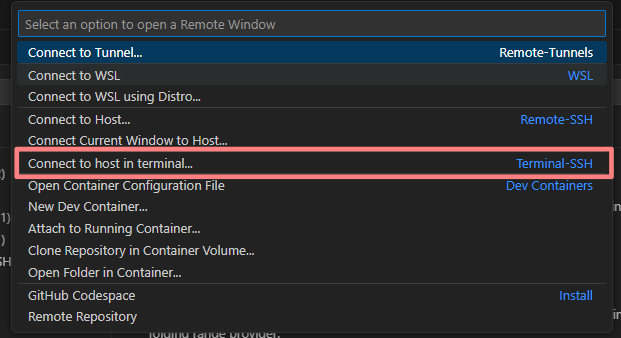

# Terminal SSH

This extension allows you to easily establish SSH connections directly within VSCode's editor pane.

## Features

- Start SSH connections directly within VSCode's editor pane.
- Connect by selecting hosts from your existing SSH configuration file (`~/.ssh/config`).
- Choose hosts from a quick pick menu or manually enter new connection information.

## Usage

1. Open the command palette (`Ctrl + Shift + P`).
1. Execute the `Terminal-SSH: Connect to host in terminal...` command.
1. You can also select from the `Open a Remote Window` option.

1. When you connect to a selected host, a new SSH session will be displayed in an editor pane.

## Private Key Authentication

- For manual connections (`user@host`), the extension first attempts to connect without explicitly specifying a key.
- If authentication fails with public key related errors, the extension prompts you to select a private key file and retry.
- The private key is selected via a file chooser dialog.

## Configuration

You can specify a custom SSH configuration file in `settings.json`:

```json
{
  "terminal-ssh.sshConfigPath": "C:\\tmp\\custom-config"
}
```

You can also set default terminal colors and per-host overrides:

```json
{
  "terminal-ssh.defaultColors": {
    "foreground": "#f0f0f0",
    "background": "#1e1e1e"
  },
  "terminal-ssh.hostColors": {
    "dev": {
      "foreground": "#d4ffd4",
      "background": "#102010"
    },
    "prod": {
      "foreground": "#ffe0e0",
      "background": "#2a1010"
    },
    "user@example.com": {
      "foreground": "#f8f8f2",
      "background": "#1b1f23"
    }
  }
}
```

Host matching is resolved in this order:

1. Exact key match (for example, `user@example.com`)
1. Host part of `user@host` (for example, `example.com`)
1. If selected from SSH config alias, resolved `HostName` and `User@HostName`
1. `terminal-ssh.defaultColors`
